# 设计模式 Mermaid 类图

本文档包含项目中已实现的设计模式的 Mermaid 类图。

---

## 1. 简单工厂模式 (Simple Factory)

严格来说它不属于 GoF 23种模式，但它是学习工厂模式的基础。由一个工厂对象决定创建出哪一种产品类的实例。

### 类图

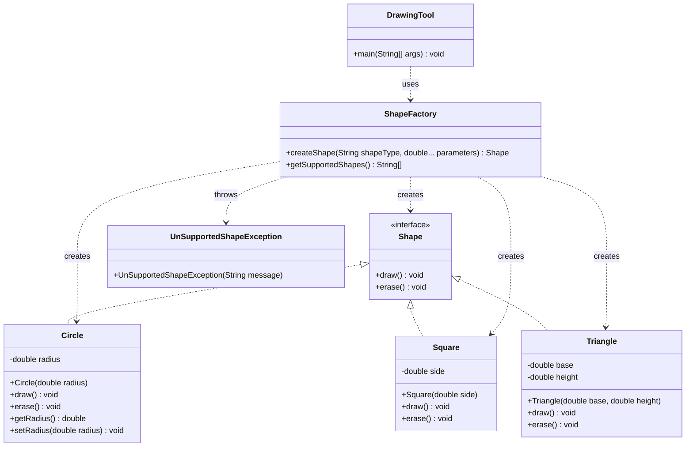

---

## 2. 工厂方法模式 (Factory Method)

定义一个用于创建对象的接口，让子类决定实例化哪一个类。工厂方法使一个类的实例化延迟到其子类。

### 类图

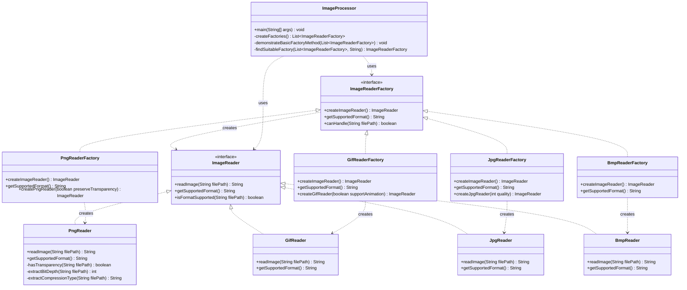

---

## 3. 抽象工厂模式 (Abstract Factory)

定义一个用于创建对象的接口，让子类决定实例化哪一个类。工厂方法使一个类的实例化延迟到其子类。

### 类图

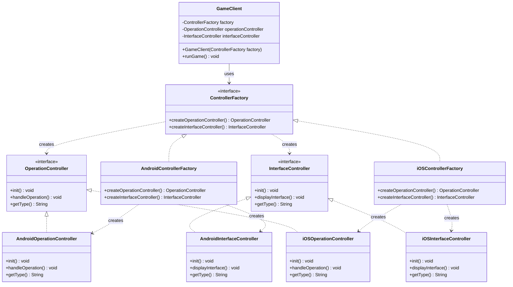

---

## 4. 原型模式 (Prototype)

用原型实例指定创建对象的种类，并且通过拷贝这些原型创建新的对象。

### 类图

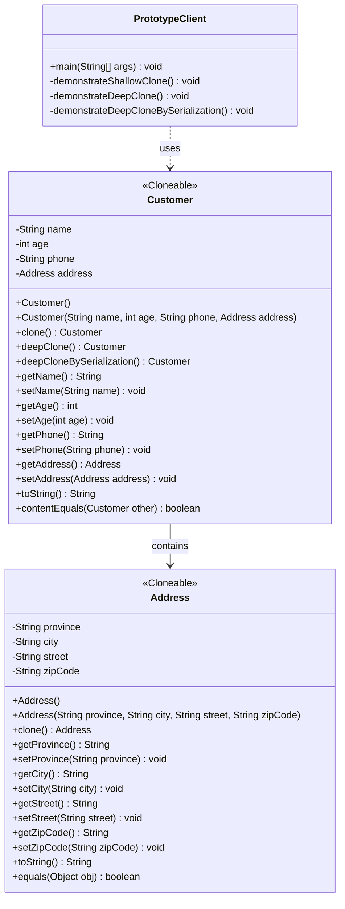

---

## 5. 建造者模式 (Builder)

将一个复杂对象的构建与它的表示分离，使得同样的构建过程可以创建不同的表示。

### 类图

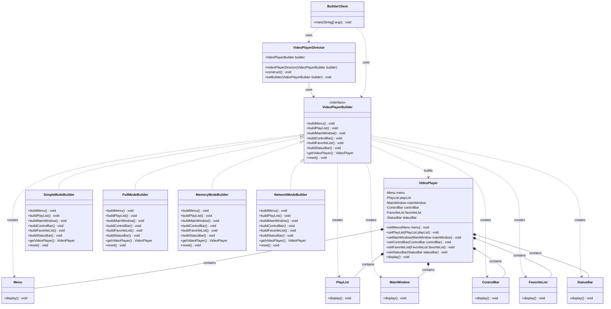

---

## 6. 适配器模式 (Adapter)

### 类图 - 对象适配器

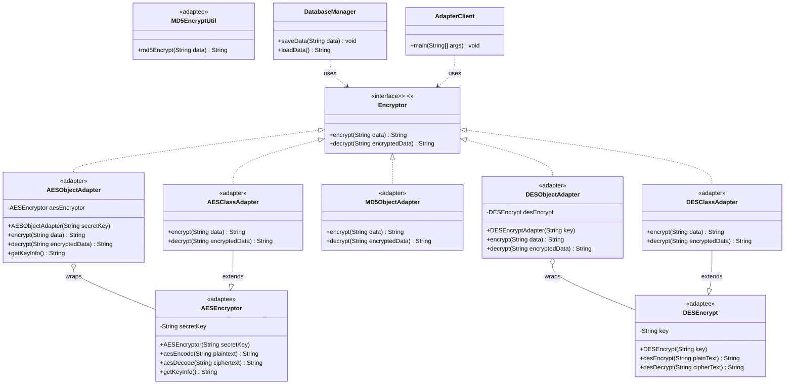

---

## 7. 桥接模式 (Bridge)

### 类图

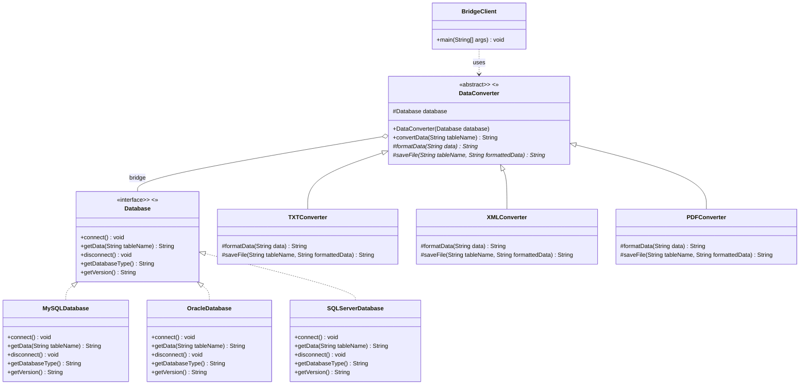

---

## 8. 组合模式 (Composite)

### 类图

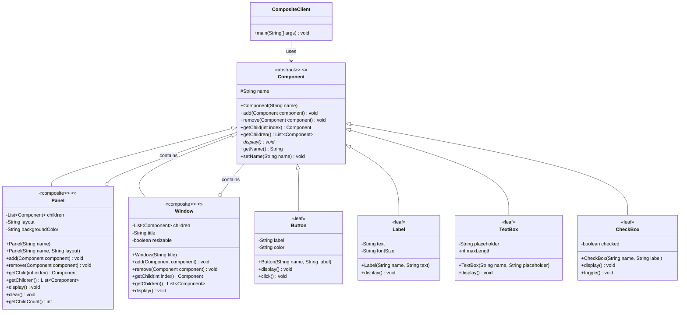

---

## 9. 装饰模式 (Decorator)

### 类图

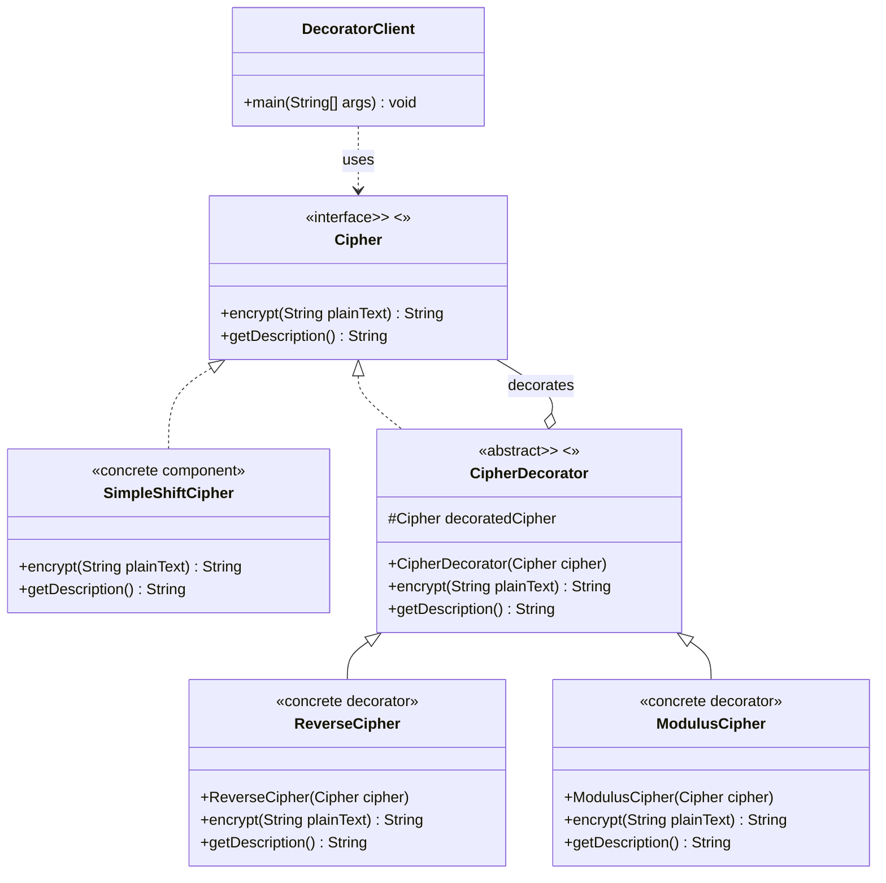

---

## 10. 外观模式 (Facade)

### 类图

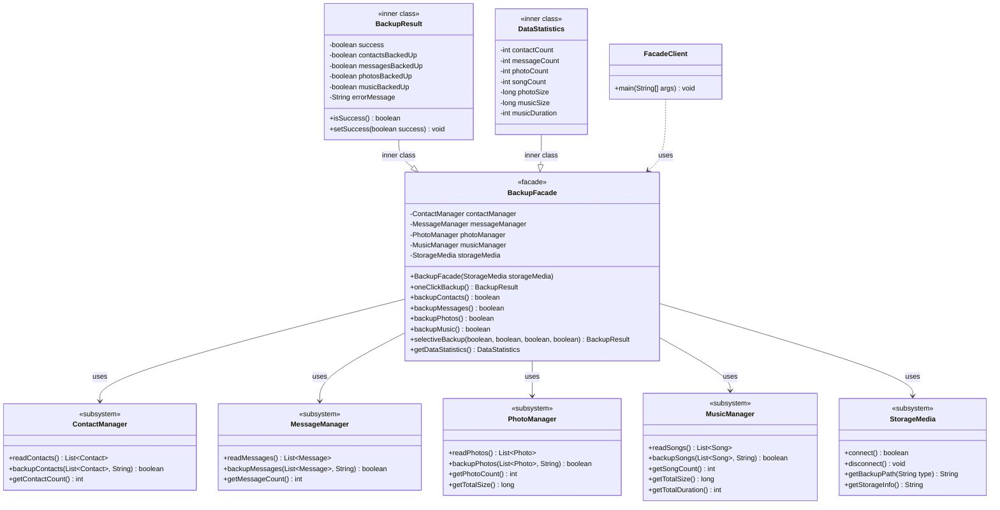

---

## 11. 享元模式 (Flyweight)

### 类图

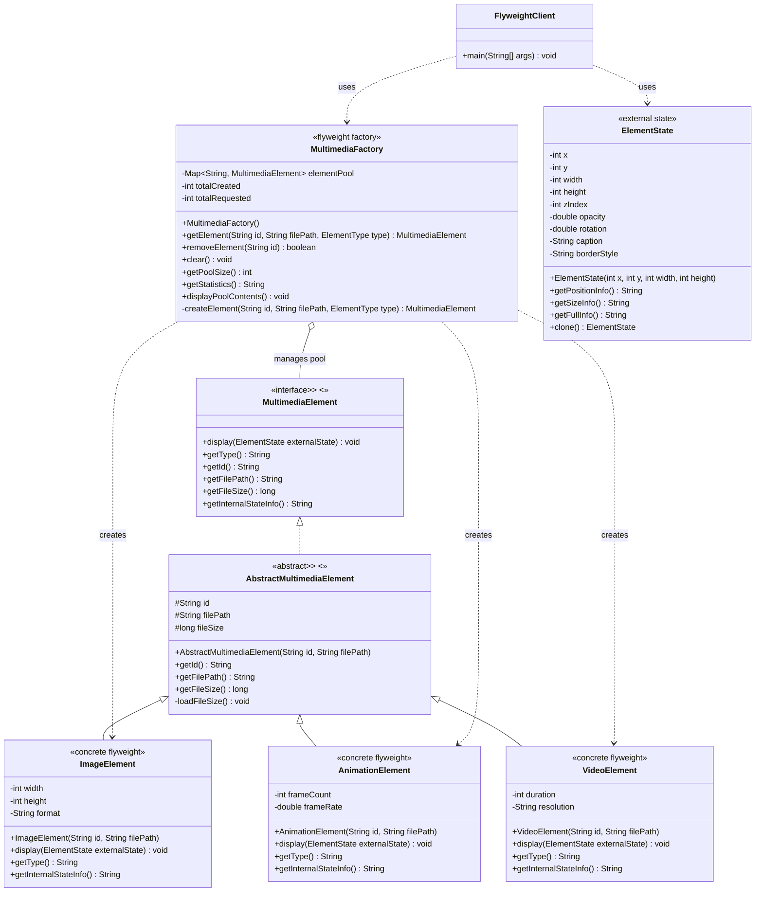

---

## 附录：设计模式分类

### 创建型模式 (Creational Patterns)
1. 简单工厂模式 (Simple Factory)
2. 工厂方法模式 (Factory Method)
3. 抽象工厂模式 (Abstract Factory)
4. 原型模式 (Prototype)
5. 建造者模式 (Builder)

### 结构型模式 (Structural Patterns)
6. 适配器模式 (Adapter)
7. 桥接模式 (Bridge)
8. 组合模式 (Composite)
9. 装饰模式 (Decorator)
10. 外观模式 (Facade)

### 行为型模式 (Behavioral Patterns)
11. 享元模式 (Flyweight)

---

*本文档由 Mermaid 语法生成，支持在 GitHub、GitLab 等平台直接渲染。*
