### 单例模式 (Singleton)

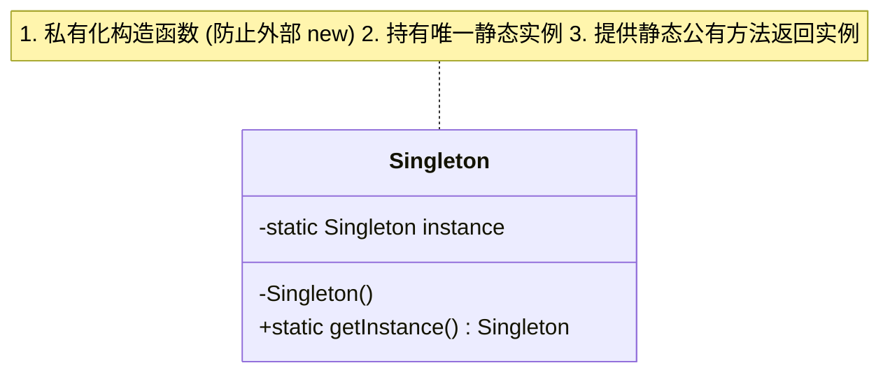
```mermaid
classDiagram
    class Singleton {
        -static Singleton instance
        -Singleton() 
        +static getInstance() Singleton
    }

    note for Singleton "1. 私有化构造函数 (防止外部 new)
    2. 持有唯一静态实例
    3. 提供静态公有方法返回实例"
```

### 1. 简单工厂模式 (Simple Factory)
严格来说它不属于 GoF 23种模式，但它是学习工厂模式的基础。由一个工厂对象决定创建出哪一种产品类的实例。

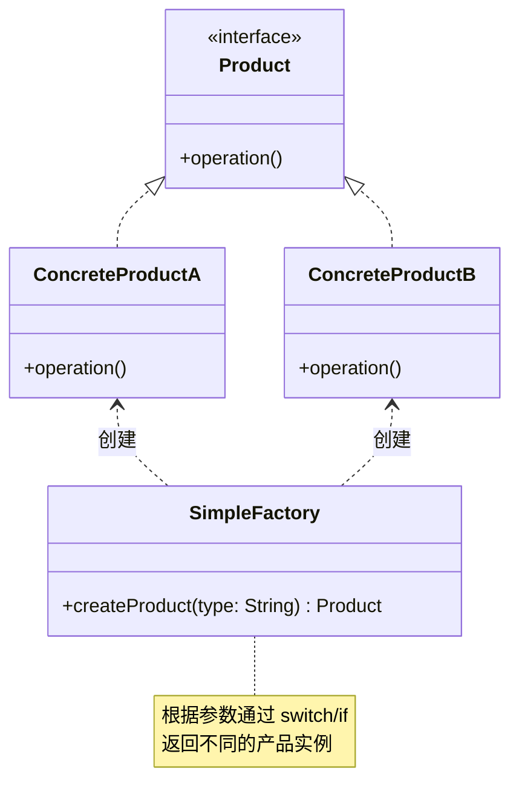
```mermaid
classDiagram
    direction BT
    class Product {
        <<interface>>
        +operation()
    }
    class ConcreteProductA {
        +operation()
    }
    class ConcreteProductB {
        +operation()
    }
    class SimpleFactory {
        +createProduct(type: String) Product
    }

    ConcreteProductA ..|> Product
    ConcreteProductB ..|> Product
    SimpleFactory ..> ConcreteProductA : 创建
    SimpleFactory ..> ConcreteProductB : 创建

    note for SimpleFactory "根据参数通过 switch/if 
    返回不同的产品实例"
```

---

### 2. 工厂方法模式 (Factory Method)
定义一个用于创建对象的接口，让子类决定实例化哪一个类。工厂方法使一个类的实例化延迟到其子类。

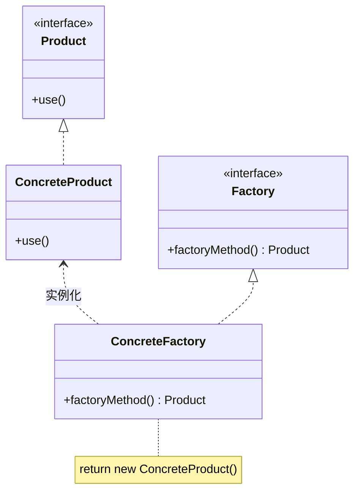
```mermaid
classDiagram
    direction BT
    %% 产品层次
    class Product {
        <<interface>>
        +use()
    }
    class ConcreteProduct {
        +use()
    }

    %% 工厂层次
    class Factory {
        <<interface>>
        +factoryMethod() Product
    }
    class ConcreteFactory {
        +factoryMethod() Product
    }

    ConcreteProduct ..|> Product
    ConcreteFactory ..|> Factory
    ConcreteFactory ..> ConcreteProduct : 实例化
  
    note for ConcreteFactory "return new ConcreteProduct()"
```

---

### 3. 抽象工厂模式 (Abstract Factory)
提供一个创建一系列相关或相互依赖对象的接口，而无需指定它们具体的类。

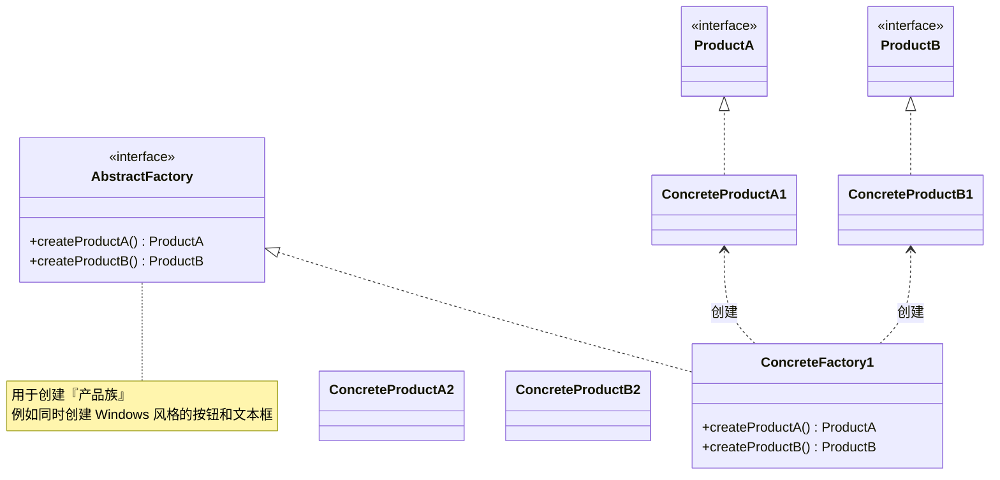
```mermaid
classDiagram
    direction BT
    %% 抽象工厂
    class AbstractFactory {
        <<interface>>
        +createProductA() ProductA
        +createProductB() ProductB
    }

    %% 具体工厂
    class ConcreteFactory1 {
        +createProductA() ProductA
        +createProductB() ProductB
    }
  
    %% 产品A系列
    class ProductA { <<interface>> }
    class ConcreteProductA1
    class ConcreteProductA2

    %% 产品B系列
    class ProductB { <<interface>> }
    class ConcreteProductB1
    class ConcreteProductB2

    ConcreteFactory1 ..|> AbstractFactory
    ConcreteProductA1 ..|> ProductA
    ConcreteProductB1 ..|> ProductB
  
    ConcreteFactory1 ..> ConcreteProductA1 : 创建
    ConcreteFactory1 ..> ConcreteProductB1 : 创建

    note for AbstractFactory "用于创建『产品族』
    例如同时创建 Windows 风格的按钮和文本框"
```

---

### 4. 原型模式 (Prototype)
用原型实例指定创建对象的种类，并且通过拷贝这些原型创建新的对象。

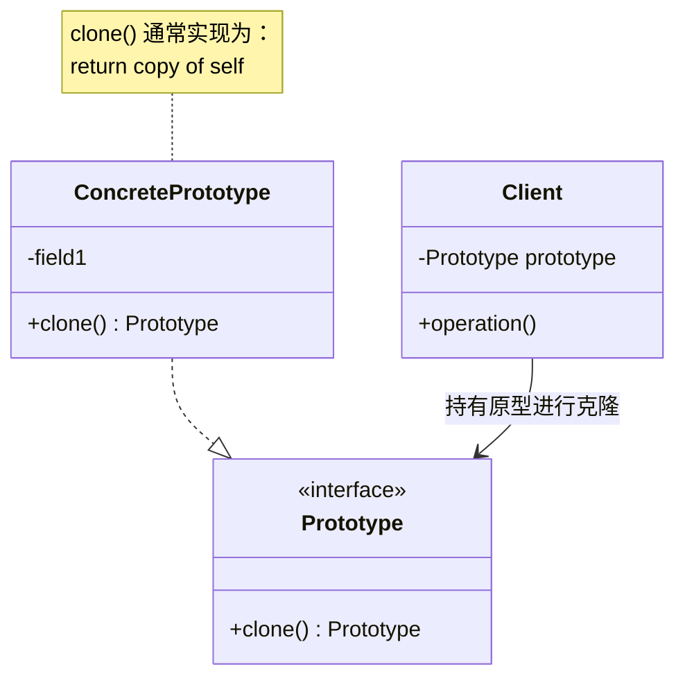
```mermaid
classDiagram
    class Prototype {
        <<interface>>
        +clone() Prototype
    }

    class ConcretePrototype {
        -field1
        +clone() Prototype
    }

    class Client {
        -Prototype prototype
        +operation()
    }

    ConcretePrototype ..|> Prototype
    Client --> Prototype : 持有原型进行克隆

    note for ConcretePrototype "clone() 通常实现为：
    return copy of self"
```

---

### 5. 建造者模式 (Builder)
将一个复杂对象的构建与它的表示分离，使得同样的构建过程可以创建不同的表示。

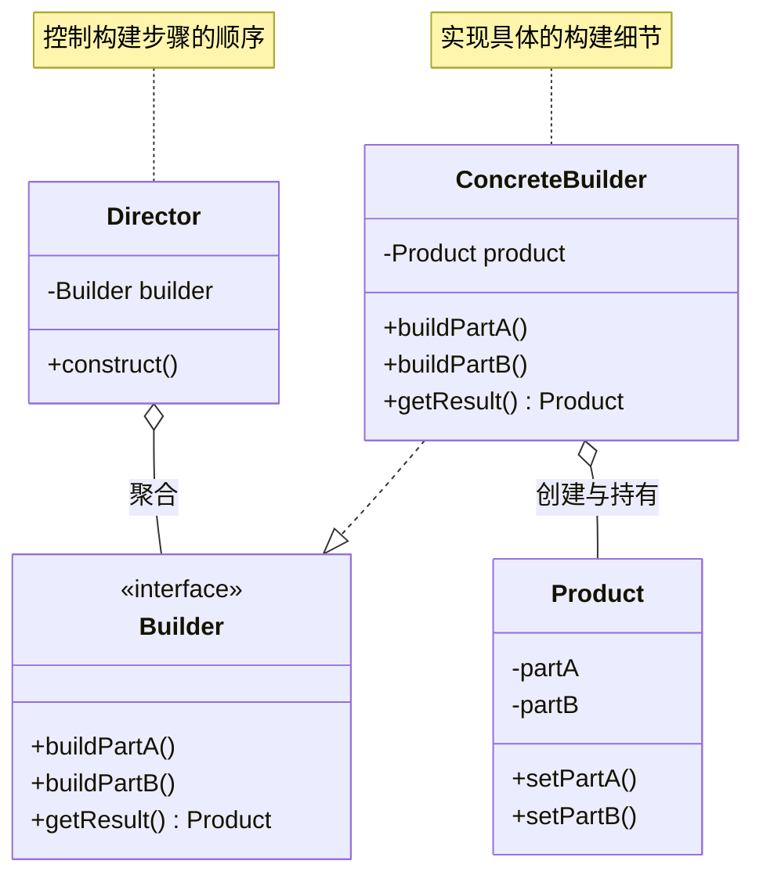
```mermaid
classDiagram
    %% 指挥者
    class Director {
        -Builder builder
        +construct()
    }

    %% 抽象建造者
    class Builder {
        <<interface>>
        +buildPartA()
        +buildPartB()
        +getResult() Product
    }

    %% 具体建造者
    class ConcreteBuilder {
        -Product product
        +buildPartA()
        +buildPartB()
        +getResult() Product
    }

    %% 复杂产品
    class Product {
        -partA
        -partB
        +setPartA()
        +setPartB()
    }

    Director o-- Builder : 聚合
    ConcreteBuilder ..|> Builder
    ConcreteBuilder o-- Product : 创建与持有
  
    note for Director "控制构建步骤的顺序"
    note for ConcreteBuilder "实现具体的构建细节"
```

---

### 总结对照表

| 模式 | 核心目的 | 关键特点 |
| :--- | :--- | :--- |
| **简单工厂** | 封装创建逻辑 | 一个工厂类完成所有判断 |
| **工厂方法** | 允许子类扩展 | 每个产品对应一个具体的工厂类 |
| **抽象工厂** | 创建产品族 | 一个工厂产生多个相关的产品 |
| **原型模式** | 绕过构造函数 | 通过 `clone` 已有对象产生新对象 |
| **建造者模式** | 控制复杂构建过程 | 拆分构建步骤，由 Director 指挥 |

### 1. 适配器模式 (Adapter)
将一个类的接口转换成客户希望的另外一个接口。主要分为“对象适配器”和“类适配器”。

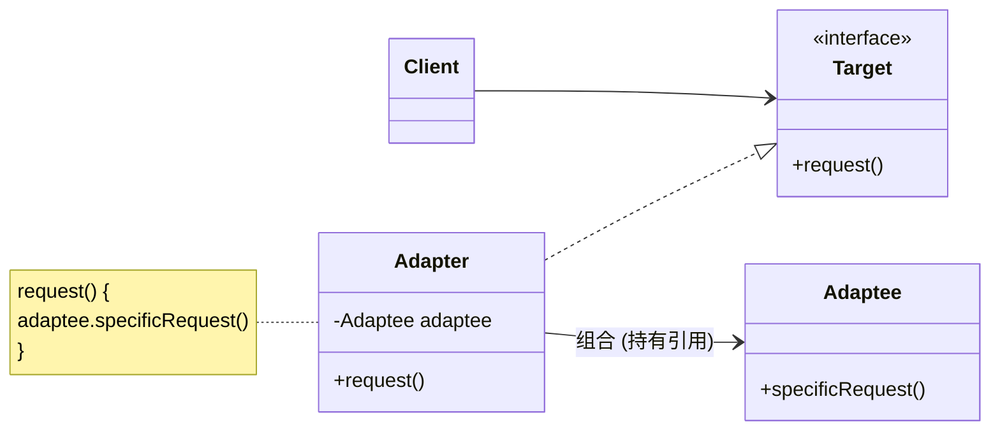
```mermaid
classDiagram
    direction LR
    class Client
    class Target {
        <<interface>>
        +request()
    }
    class Adaptee {
        +specificRequest()
    }
    class Adapter {
        -Adaptee adaptee
        +request()
    }

    Client --> Target
    Adapter ..|> Target
    Adapter --> Adaptee : 组合 (持有引用)
  
    note for Adapter "request() { 
      adaptee.specificRequest() 
      }"
```

---

### 2. 装饰器模式 (Decorator)
动态地给一个对象添加一些额外的职责。要求装饰对象与被装饰对象实现相同的接口。

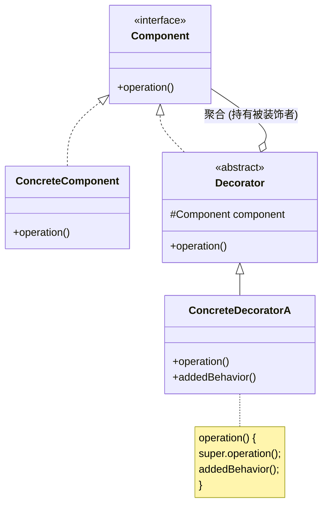
```mermaid
classDiagram
    direction BT
    class Component {
        <<interface>>
        +operation()
    }
    class ConcreteComponent {
        +operation()
    }
    class Decorator {
        <<abstract>>
        #Component component
        +operation()
    }
    class ConcreteDecoratorA {
        +operation()
        +addedBehavior()
    }

    ConcreteComponent ..|> Component
    Decorator ..|> Component
    Decorator o-- Component : 聚合 (持有被装饰者)
    ConcreteDecoratorA --|> Decorator

    note for ConcreteDecoratorA "operation() { 
        super.operation(); 
        addedBehavior(); 
    }"
```

---

### 3. 代理模式 (Proxy)
为其他对象提供一种代理以控制对这个对象的访问。

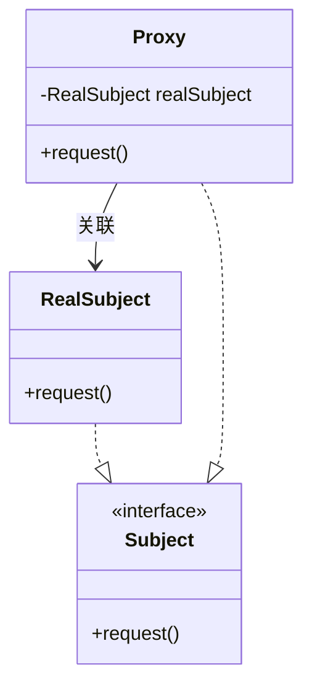
```mermaid
classDiagram
    class Subject {
        <<interface>>
        +request()
    }
    class RealSubject {
        +request()
    }
    class Proxy {
        -RealSubject realSubject
        +request()
    }

    RealSubject ..|> Subject
    Proxy ..|> Subject
    Proxy --> RealSubject : 关联
```

---

### 4. 外观模式 (Facade)
为子系统中的一组接口提供一个一致的界面，隐藏子系统的复杂性。

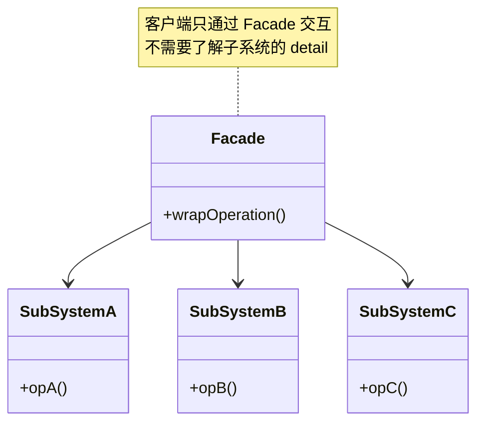
```mermaid
classDiagram
    class Facade {
        +wrapOperation()
    }
    class SubSystemA { +opA() }
    class SubSystemB { +opB() }
    class SubSystemC { +opC() }

    Facade --> SubSystemA
    Facade --> SubSystemB
    Facade --> SubSystemC

    note for Facade "客户端只通过 Facade 交互
    不需要了解子系统的 detail"
```

---

### 5. 桥接模式 (Bridge)
将抽象部分与它的实现部分分离，使它们都可以独立地变化。解决多维度扩展导致的类爆炸问题。

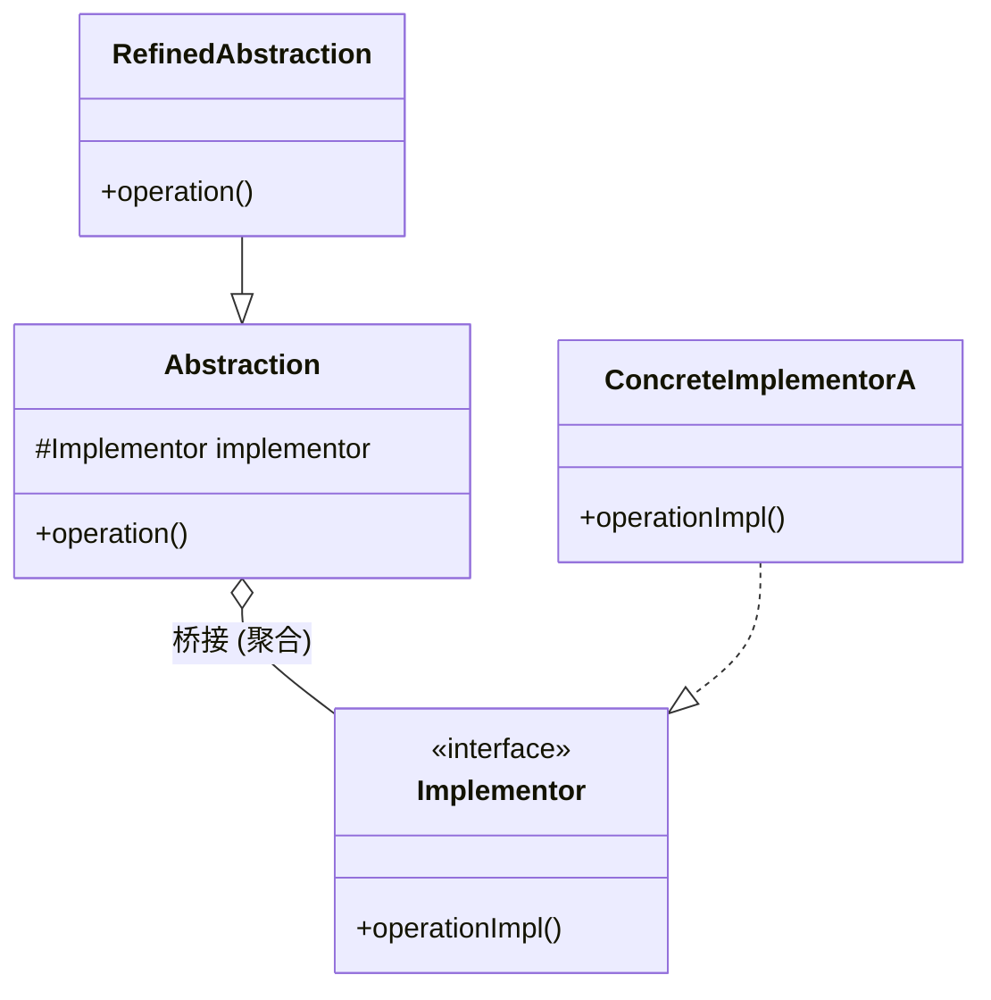
```mermaid
classDiagram
    class Abstraction {
        #Implementor implementor
        +operation()
    }
    class RefinedAbstraction {
        +operation()
    }
    class Implementor {
        <<interface>>
        +operationImpl()
    }
    class ConcreteImplementorA {
        +operationImpl()
    }

    Abstraction o-- Implementor : 桥接 (聚合)
    RefinedAbstraction --|> Abstraction
    ConcreteImplementorA ..|> Implementor
```

---

### 6. 组合模式 (Composite)
将对象组合成树形结构以表示“部分-整体”的层次结构，使得用户对单个对象和组合对象的使用具有一致性。

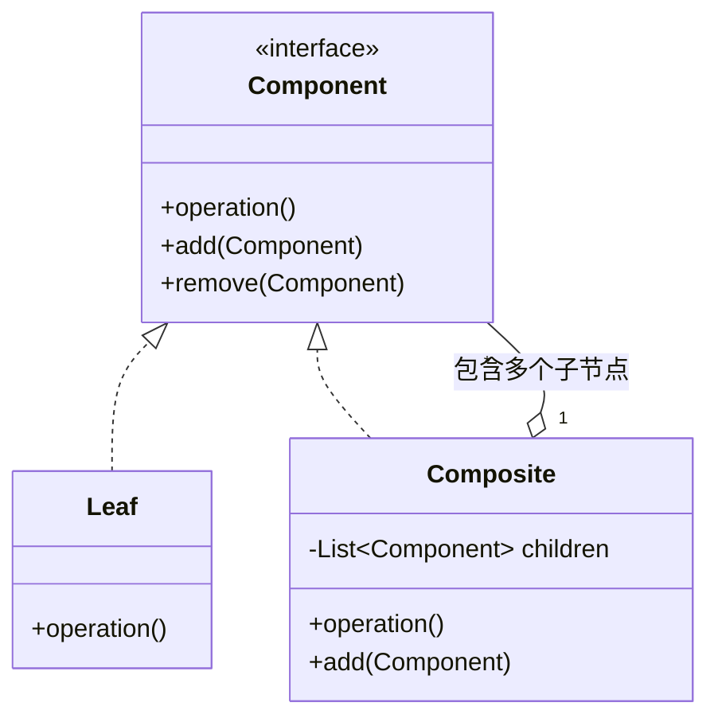
```mermaid
classDiagram
    direction BT
    class Component {
        <<interface>>
        +operation()
        +add(Component)
        +remove(Component)
    }
    class Leaf {
        +operation()
    }
    class Composite {
        -List~Component~ children
        +operation()
        +add(Component)
    }

    Leaf ..|> Component
    Composite ..|> Component
    Composite "1" o-- "*" Component : 包含多个子节点
```

---

### 7. 享元模式 (Flyweight)
运用共享技术有效地支持大量细粒度的对象。区分“内部状态（共享）”和“外部状态（非共享）”。

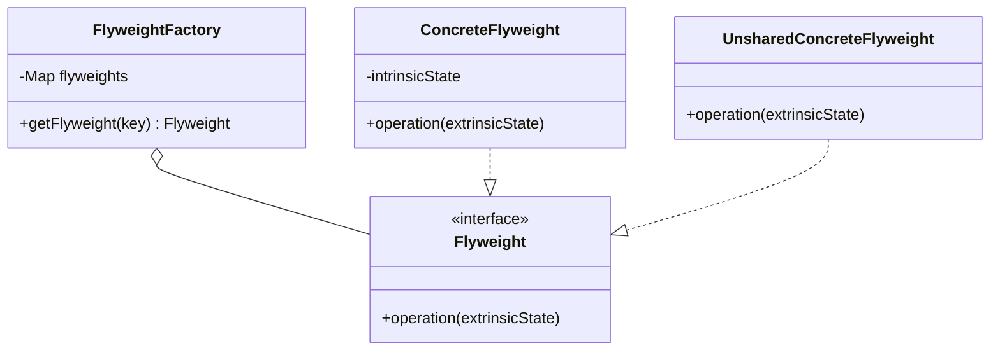
```mermaid
classDiagram
    class FlyweightFactory {
        -Map flyweights
        +getFlyweight(key) Flyweight
    }
    class Flyweight {
        <<interface>>
        +operation(extrinsicState)
    }
    class ConcreteFlyweight {
        -intrinsicState
        +operation(extrinsicState)
    }
    class UnsharedConcreteFlyweight {
        +operation(extrinsicState)
    }

    FlyweightFactory o-- Flyweight
    ConcreteFlyweight ..|> Flyweight
    UnsharedConcreteFlyweight ..|> Flyweight
```

---

### 结构型模式核心总结

| 模式 | 核心关键词 | 应用场景示例 |
| :--- | :--- | :--- |
| **适配器** | 转换接口 | 让老接口在旧框架里运行 |
| **装饰器** | 动态增加功能 | Java IO 流（BufferedInputStream） |
| **代理** | 控制访问 | 远程代理、安全控制、缓存代理 |
| **外观** | 简化调用 | 医院的分诊台（对接多个科室） |
| **桥接** | 维度解耦 | 手机类型（品牌和操作系统两个维度） |
| **组合** | 树形结构 | 文件系统（文件夹与文件的关系） |
| **享元** | 共享对象 | 下围棋（棋子只有黑白两色，位置是外部状态） |

行为型模式（Behavioral Patterns）关注对象之间的**通信**、**职责分配**以及**算法的运行机制**。

以下是 GoF 定义的 11 种行为型模式的详细 Mermaid 类图。

---

### 1. 策略模式 (Strategy)
定义一系列算法，将它们一个个封装起来，并使它们可相互替换。

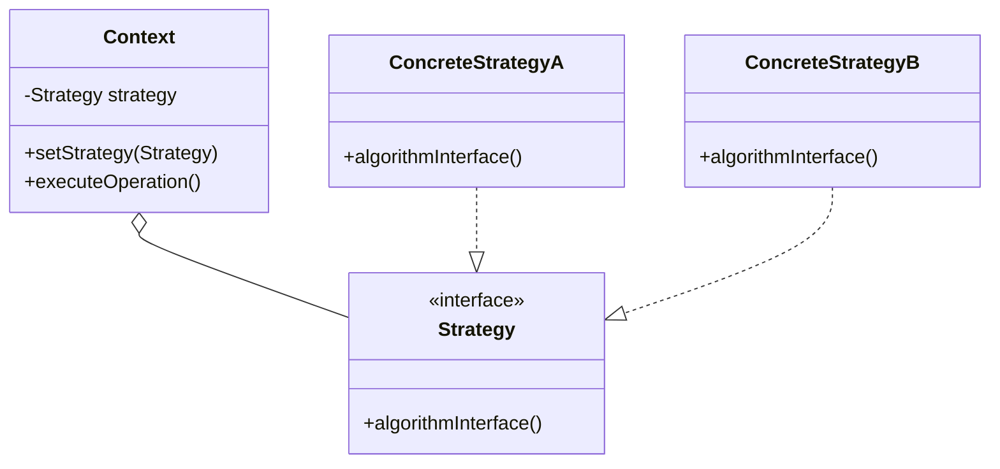
```mermaid
classDiagram
    class Context {
        -Strategy strategy
        +setStrategy(Strategy)
        +executeOperation()
    }
    class Strategy {
        <<interface>>
        +algorithmInterface()
    }
    class ConcreteStrategyA {
        +algorithmInterface()
    }
    class ConcreteStrategyB {
        +algorithmInterface()
    }

    Context o-- Strategy
    ConcreteStrategyA ..|> Strategy
    ConcreteStrategyB ..|> Strategy
```

---

### 2. 观察者模式 (Observer)
定义对象间的一种一对多的依赖关系，当一个对象的状态发生改变时，所有依赖于它的对象都得到通知并被自动更新。

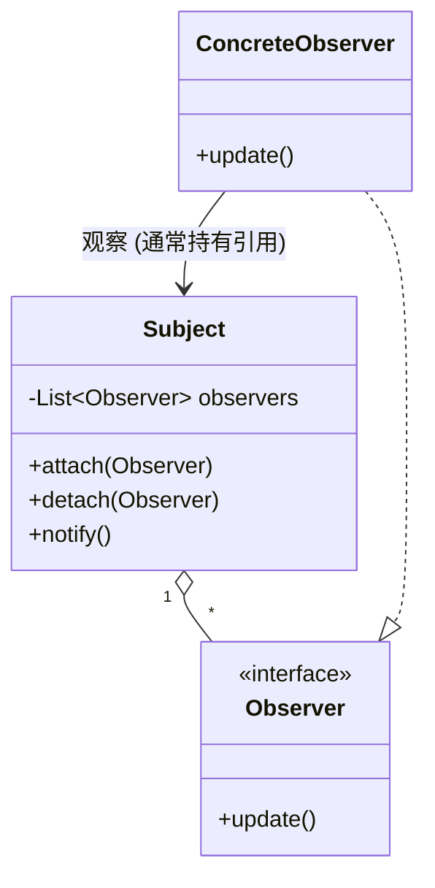
```mermaid
classDiagram
    class Subject {
        -List~Observer~ observers
        +attach(Observer)
        +detach(Observer)
        +notify()
    }
    class Observer {
        <<interface>>
        +update()
    }
    class ConcreteObserver {
        +update()
    }

    Subject "1" o-- "*" Observer
    ConcreteObserver ..|> Observer
    ConcreteObserver --> Subject : 观察 (通常持有引用)
```

---

### 3. 模板方法模式 (Template Method)
定义一个操作中的算法的骨架，而将一些步骤延迟到子类中。

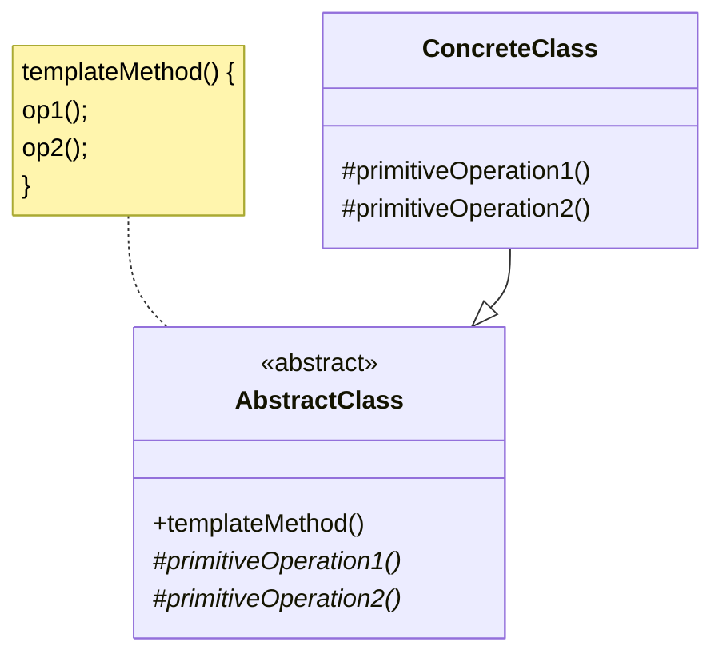
```mermaid
classDiagram
    class AbstractClass {
        <<abstract>>
        +templateMethod()
        #primitiveOperation1()*
        #primitiveOperation2()*
    }
    class ConcreteClass {
        #primitiveOperation1()
        #primitiveOperation2()
    }

    ConcreteClass --|> AbstractClass
    note for AbstractClass "templateMethod() {
          op1();
          op2();
        }"
```

---

### 4. 迭代器模式 (Iterator)
提供一种方法顺序访问一个聚合对象中各个元素，而又不暴露该对象的内部表示。

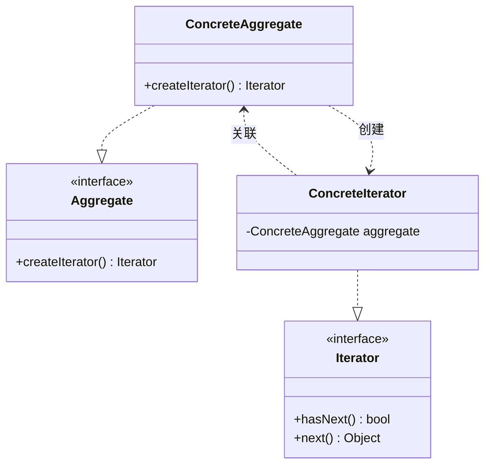
```mermaid
classDiagram
    class Aggregate {
        <<interface>>
        +createIterator() Iterator
    }
    class Iterator {
        <<interface>>
        +hasNext() bool
        +next() Object
    }
    class ConcreteAggregate {
        +createIterator() Iterator
    }
    class ConcreteIterator {
        -ConcreteAggregate aggregate
    }

    ConcreteAggregate ..|> Aggregate
    ConcreteIterator ..|> Iterator
    ConcreteAggregate <.. ConcreteIterator : 关联
    ConcreteAggregate ..> ConcreteIterator : 创建
```

---

### 5. 责任链模式 (Chain of Responsibility)
使多个对象都有机会处理请求，从使请求的发送者和接收者解耦。

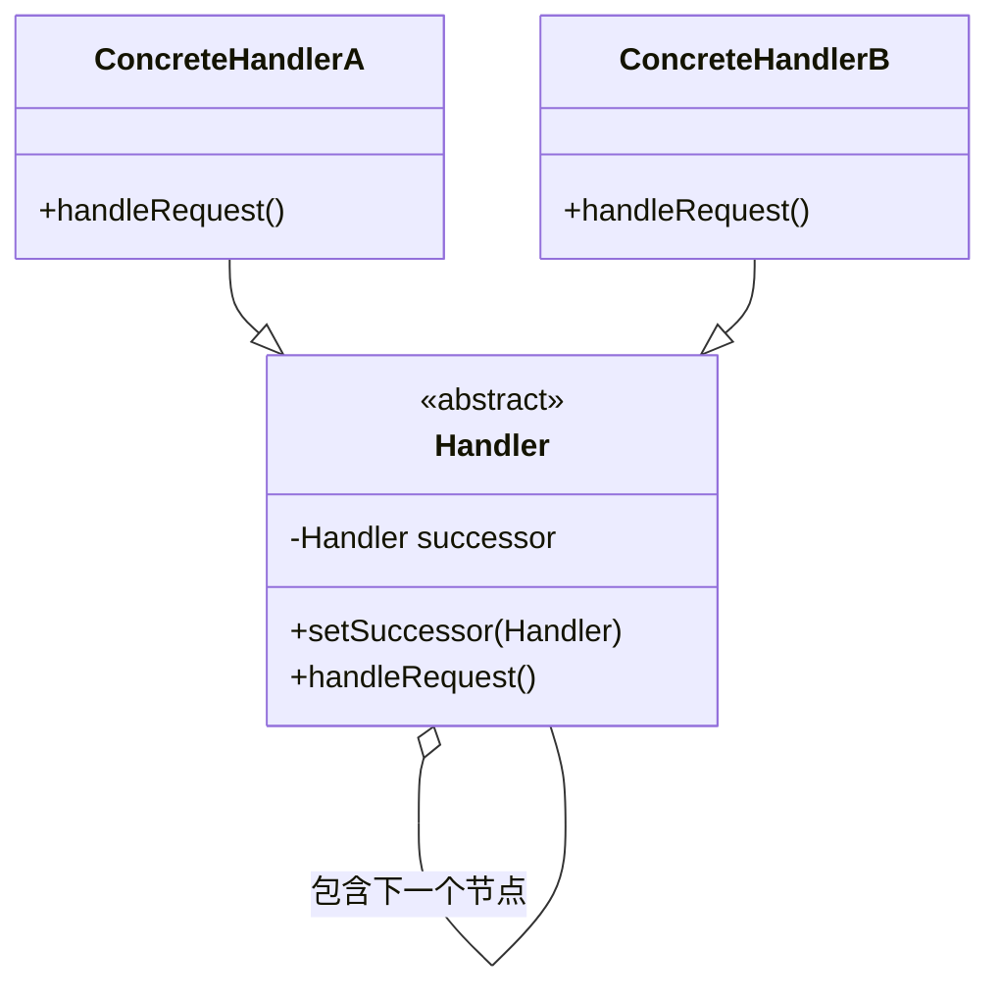
```mermaid
classDiagram
    class Handler {
        <<abstract>>
        -Handler successor
        +setSuccessor(Handler)
        +handleRequest()
    }
    class ConcreteHandlerA {
        +handleRequest()
    }
    class ConcreteHandlerB {
        +handleRequest()
    }

    ConcreteHandlerA --|> Handler
    ConcreteHandlerB --|> Handler
    Handler o-- Handler : 包含下一个节点
```

---

### 6. 命令模式 (Command)
将一个请求封装为一个对象，从而使你可用不同的请求对客户进行参数化。

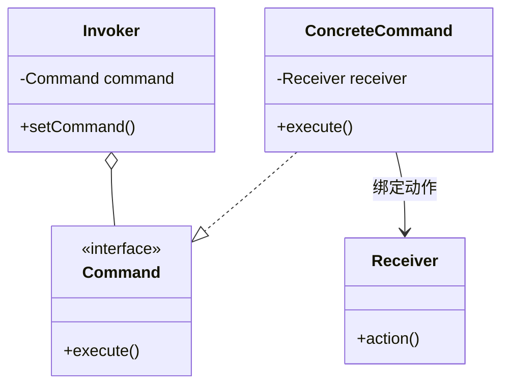
```mermaid
classDiagram
    class Invoker {
        -Command command
        +setCommand()
    }
    class Command {
        <<interface>>
        +execute()
    }
    class ConcreteCommand {
        -Receiver receiver
        +execute()
    }
    class Receiver {
        +action()
    }

    Invoker o-- Command
    ConcreteCommand ..|> Command
    ConcreteCommand --> Receiver : 绑定动作
```

---

### 7. 状态模式 (State)
允许一个对象在其内部状态改变时改变它的行为。

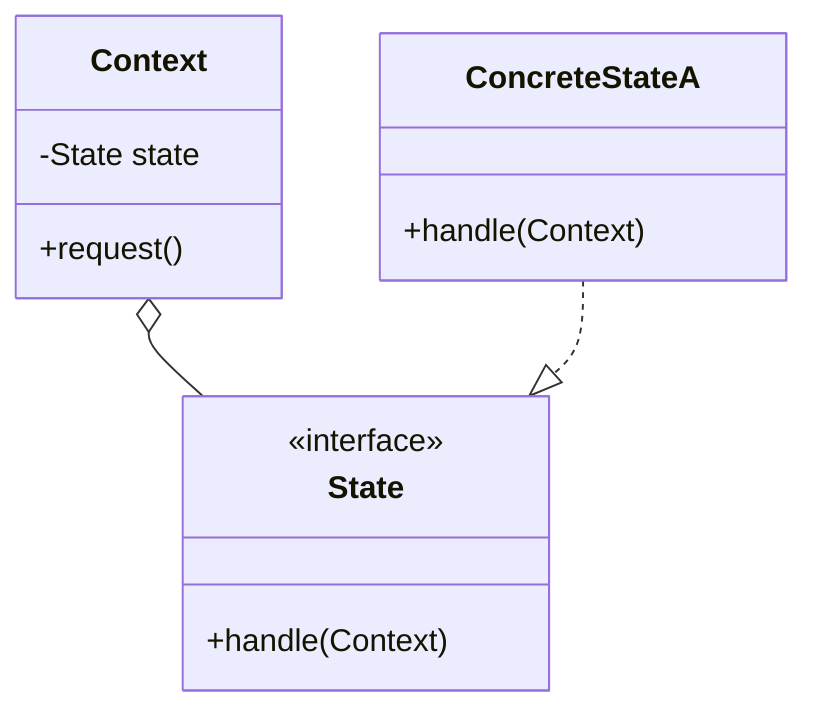
```mermaid
classDiagram
    class Context {
        -State state
        +request()
    }
    class State {
        <<interface>>
        +handle(Context)
    }
    class ConcreteStateA {
        +handle(Context)
    }

    Context o-- State
    ConcreteStateA ..|> State
```

---

### 8. 备忘录模式 (Memento)
在不破坏封装性的前提下，捕获一个对象的内部状态，并在该对象之外保存这个状态，以便以后将对象恢复到原先保存的状态。

```mermaid
classDiagram
    class Originator {
        -state
        +createMemento() Memento
        +setMemento(Memento)
    }
    class Memento {
        -state
        +getState()
    }
    class Caretaker {
        -Memento memento
    }

    Caretaker o-- Memento
    Originator ..> Memento : 创建/使用
```

---

### 9. 中介者模式 (Mediator)
用一个中介对象来封装一系列的对象交互，使各对象不需要显式地相互引用，从而使其耦合松散。

```mermaid
classDiagram
    class Mediator {
        <<interface>>
        +send(message, Colleague)
    }
    class ConcreteMediator {
        -ColleagueA c1
        -ColleagueB c2
    }
    class Colleague {
        #Mediator mediator
    }

    ConcreteMediator ..|> Mediator
    Colleague --> Mediator
    ConcreteMediator o-- Colleague
```

---

### 10. 解释器模式 (Interpreter)
给定一个语言，定义它的文法的一种表示，并定义一个解释器，这个解释器使用该表示来解释语言中的句子。

```mermaid
classDiagram
    class AbstractExpression {
        +interpret(Context)
    }
    class TerminalExpression {
        +interpret(Context)
    }
    class NonterminalExpression {
        -List~AbstractExpression~ children
        +interpret(Context)
    }

    TerminalExpression --|> AbstractExpression
    NonterminalExpression --|> AbstractExpression
    NonterminalExpression o-- AbstractExpression
```

---

### 11. 访问者模式 (Visitor)
表示一个作用于某对象结构中的各元素的操作。它使你可以在不改变各元素的类的前提下定义作用于这些元素的新操作。

```mermaid
classDiagram
    class Visitor {
        <<interface>>
        +visitConcreteElementA(ElementA)
        +visitConcreteElementB(ElementB)
    }
    class Element {
        <<interface>>
        +accept(Visitor)
    }
    class ConcreteElementA {
        +accept(Visitor)
    }
    class ConcreteVisitor {
        +visitConcreteElementA(ElementA)
    }

    ConcreteElementA ..|> Element
    ConcreteVisitor ..|> Visitor
    note for ConcreteElementA "accept(v) { v.visit(this) }"
```

---

### 总结对照

| 模式 | 核心目的 | 典型场景 |
| :--- | :--- | :--- |
| **策略** | 封装算法切换 | 支付方式选择 (支付宝/微信) |
| **观察者** | 事件通知联动 | 消息推送、UI 组件监听 |
| **模板方法** | 流程固定，步骤定制 | 框架基类 (如 Servlet 的 service) |
| **责任链** | 传递请求直到处理 | 请假审批流、过滤器链 |
| **命令** | 请求参数化/撤销 | 菜单按钮点击、宏录制 |
| **状态** | 状态驱动行为 | 订单状态流转 (待支付->已收货) |
| **访问者** | 结构与操作分离 | 编译器语法树分析 |