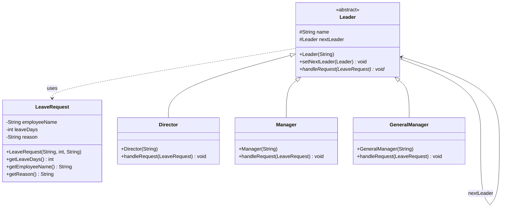

# 职责链模式 (Chain of Responsibility) - 假条审批模块

## 模式简介
职责链模式 (Chain of Responsibility Pattern) 是一种行为设计模式，允许你将请求沿着处理者链进行发送。收到请求后，每个处理者均可对请求进行处理，或将其传递给链上的下个处理者。

## 场景描述
Sunny软件公司的OA系统假条审批模块：
- **请假 < 3天**: 主任审批 (Director)。
- **3天 <= 请假 < 10天**: 经理审批 (Manager)。
- **10天 <= 请假 < 30天**: 总经理审批 (GeneralManager)。
- **请假 >= 30天**: 总经理拒绝，提示拒绝信息。

## 实现方案
1.  **LeaveRequest**: 封装请假信息（姓名、天数、理由）。
2.  **Leader (抽象处理者)**: 定义处理请求的接口 `handleRequest`，持有下一个处理者 `nextLeader` 的引用。
3.  **Concrete Handlers (具体处理者)**:
    - `Director`: 处理 < 3天。
    - `Manager`: 处理 [3, 10) 天。
    - `GeneralManager`: 处理 [10, 30) 天，拒绝 >= 30 天。
4.  **Client**: 构建职责链 (Director -> Manager -> GeneralManager)，并提交请求。

## 类图结构

- **Handler**: `Leader`
- **ConcreteHandler**: `Director`, `Manager`, `GeneralManager`
- **Request**: `LeaveRequest`

## 关键代码
```java
// 构建链
director.setNextLeader(manager);
manager.setNextLeader(generalManager);

// 处理请求 (Director)
if (request.getLeaveDays() < 3) {
    // 处理...
} else {
    if (this.nextLeader != null) {
        this.nextLeader.handleRequest(request);
    }
}
```
