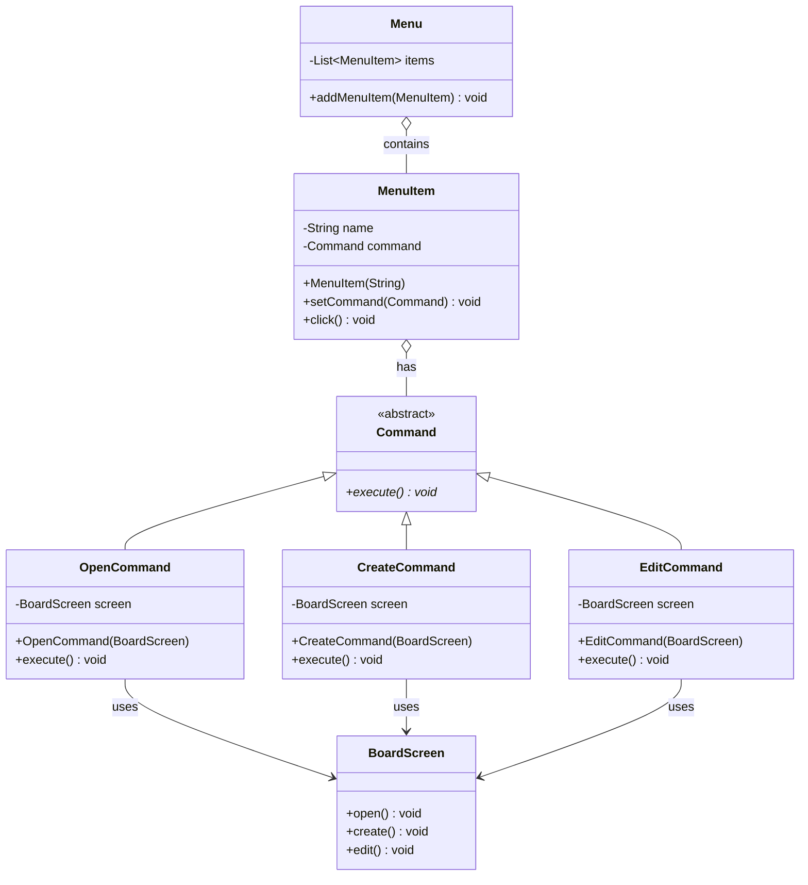

# 命令模式 (Command Pattern) - 公告板系统

## 模式简介
命令模式 (Command Pattern) 是一种行为设计模式，它将请求封装为一个对象，从而使你可用不同的请求对客户进行参数化；对请求排队或记录请求日志，以及支持可撤销的操作。

## 场景描述
Sunny软件公司开发基于Windows平台的公告板系统：
- 主菜单 (Menu) 包含多个菜单项 (MenuItem)。
- 菜单项点击 (`click()`) 后执行特定操作。
- 操作包括：打开 (Open), 新建 (Create), 编辑 (Edit)，对应 `BoardScreen` 类的相应方法。
- 目标：降低 `MenuItem` 与 `BoardScreen` 之间的耦合。

## 实现方案
1.  **Command (抽象命令类)**: 定义 `execute()` 接口。
2.  **ConcreteCommand (具体命令类)**: `OpenCommand`, `CreateCommand`, `EditCommand`.
    - 持有 `BoardScreen` (Receiver) 的引用。
    - 在 `execute()` 中调用 `BoardScreen` 的对应方法。
3.  **Invoker (调用者)**: `MenuItem`.
    - 持有 `Command` 对象。
    - `click()` 方法调用 `command.execute()`.
4.  **Receiver (接收者)**: `BoardScreen`.
    - 包含实际的业务逻辑 (`open()`, `create()`, `edit()`).
5.  **Client**: 组装命令对象和调用者。

## 类图结构


## 关键代码
```java
// MenuItem (Invoker)
public void click() {
    command.execute();
}

// OpenCommand (Concrete Command)
public void execute() {
    boardScreen.open();
}
```
