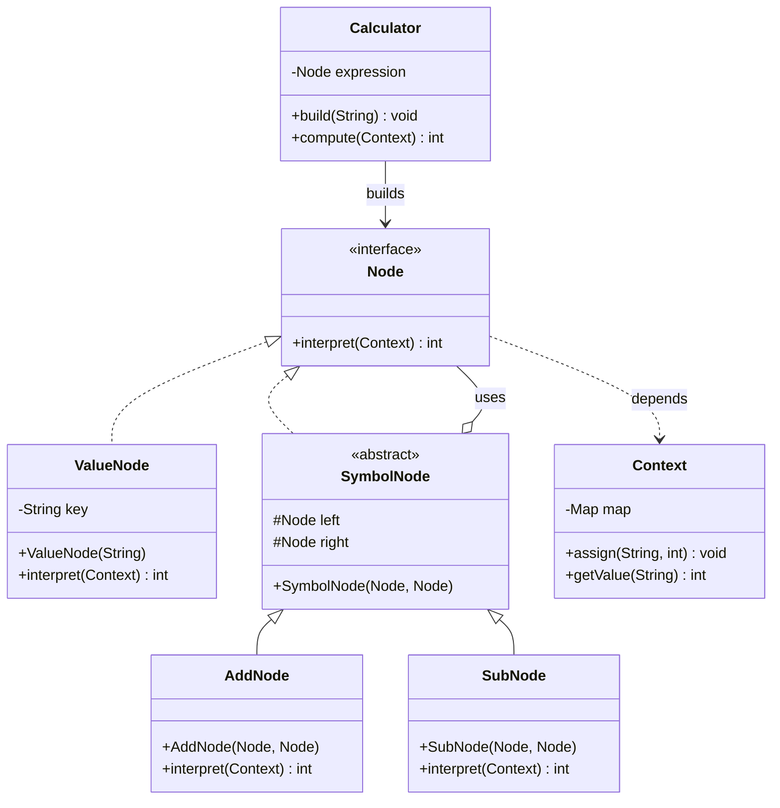

# 解释器模式 (Interpreter Pattern) - 加减法计算器

## 模式简介
解释器模式 (Interpreter Pattern) 提供了评估语言的语法或表达式的方式。它定义了一个表达式接口，该接口解释一个特定的上下文。

## 场景描述
实现一个简单的加减法解释器。
- 输入字符串如 "a + b - c"。
- 上下文提供变量值 (a=100, b=20, c=40)。
- 解析器构建抽象语法树 (AST)。
- 调用 `interpret()` 递归计算结果。

## 类图结构


## 关键代码
1.  **Node (AbstractExpression)**: 
    ```java
    public interface Node {
        int interpret(Context context);
    }
    ```
2.  **AddNode (NonTerminal)**:
    ```java
    public int interpret(Context context) {
        return super.left.interpret(context) + super.right.interpret(context);
    }
    ```
3.  **Calculator (Client Helper)**:
    利用栈 (Stack) 解析后缀或中缀表达式构建 AST。本示例简化为顺序读取构建。
