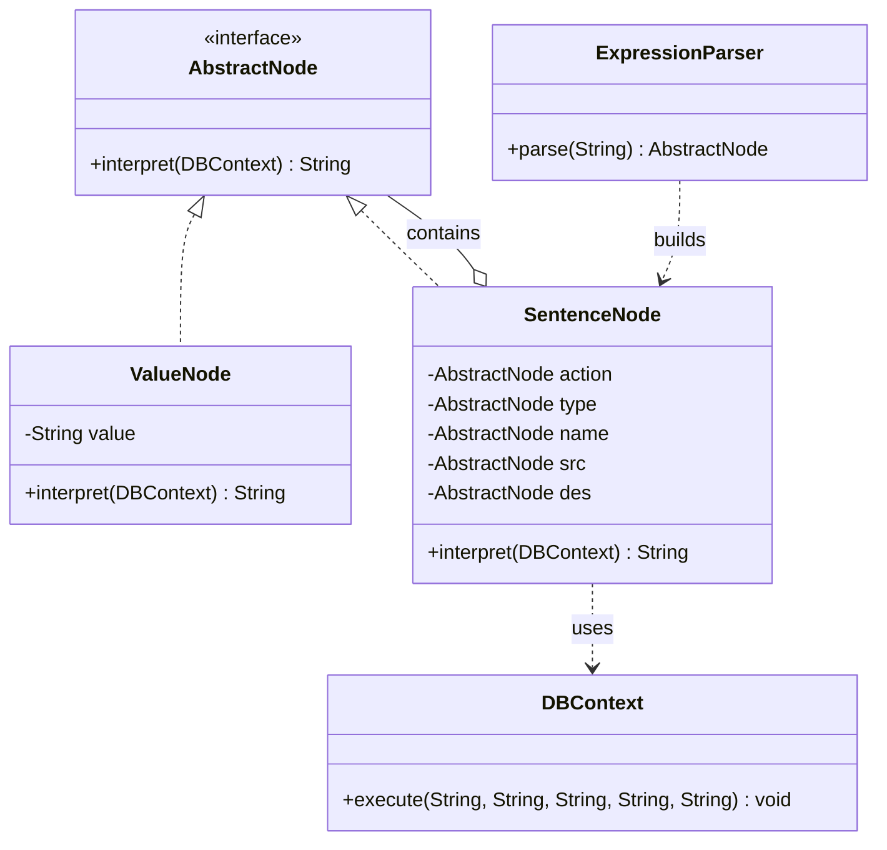

# 解释器模式 (Interpreter Pattern) - 数据库同步指令

## 模式简介
解释器模式 (Interpreter Pattern) 提供了评估语言的语法或表达式的方式。

## 场景描述
Sunny软件公司开发数据库同步指令：
- `COPY VIEW FROM srcDB TO desDB`: 复制所有视图。
- `MOVE TABLE Student FROM srcDB TO desDB`: 移动 Student 表。
- 关键字：COPY, MOVE, VIEW, TABLE, FROM, TO。

## 实现方案
1.  **AbstractNode**: 解释器接口 `interpret(DBContext)`.
2.  **ValueNode (Terminal)**: 存储具体字符串值（如 "COPY", "Student", "srcDB"）。
3.  **SentenceNode (NonTerminal)**: 组合动作、类型、名称、源、目标，调用 `context.execute`。
4.  **ExpressionParser**: 解析字符串指令，构建 AST (`SentenceNode` 包含多个 `ValueNode`)。
5.  **DBContext**: 执行实际的业务逻辑 (模拟打印)。

## 类图结构

