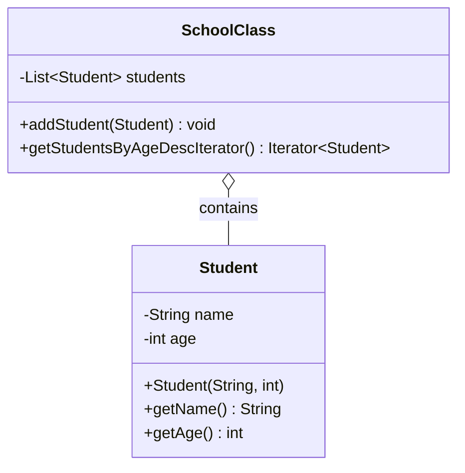
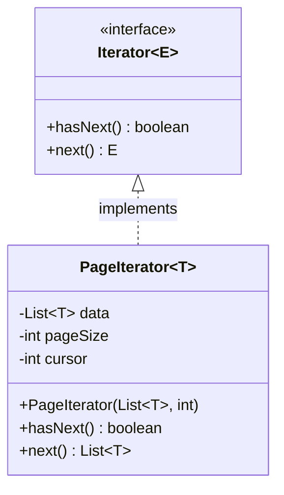

# 迭代器模式 (Iterator Pattern) - 两个练习

## 练习1：学生按年龄排序遍历

### 场景描述
在Sunny软件公司开发的某教务管理系统中，一个班级 (SchoolClass) 包含多个学生 (Student)。使用 Java 内置迭代器实现对学生信息的遍历，要求按学生年龄由大到小的次序输出学生信息。

### 实现方案
1.  **Student**: 包含姓名和年龄。
2.  **SchoolClass**: 内部维护 `List<Student>`。
3.  **getStudentsByAgeDescIterator()**: 
    - 复制列表以避免修改原数据。
    - 使用 `Collections.sort` 进行降序排序。
    - 返回排序后列表的迭代器。

### 类图结构

---

## 练习2：分页迭代器

### 场景描述
设计一个逐页迭代器，每次可返回指定个数（一页）元素，并将该迭代器用于对数据进行分页处理。

### 实现方案
1.  **PageIterator<T>**: 实现 `Iterator<List<T>>`。
2.  **构造函数**: 接收数据源 `List<T>` 和 `pageSize`。
3.  **hasNext()**: 检查游标 `cursor` 是否小于列表大小。
4.  **next()**: 
    - 计算当前页的结束索引 `min(cursor + pageSize, size)`。
    - 使用 `subList` 获取当前页数据。
    - 更新游标 `cursor`。

### 类图结构

