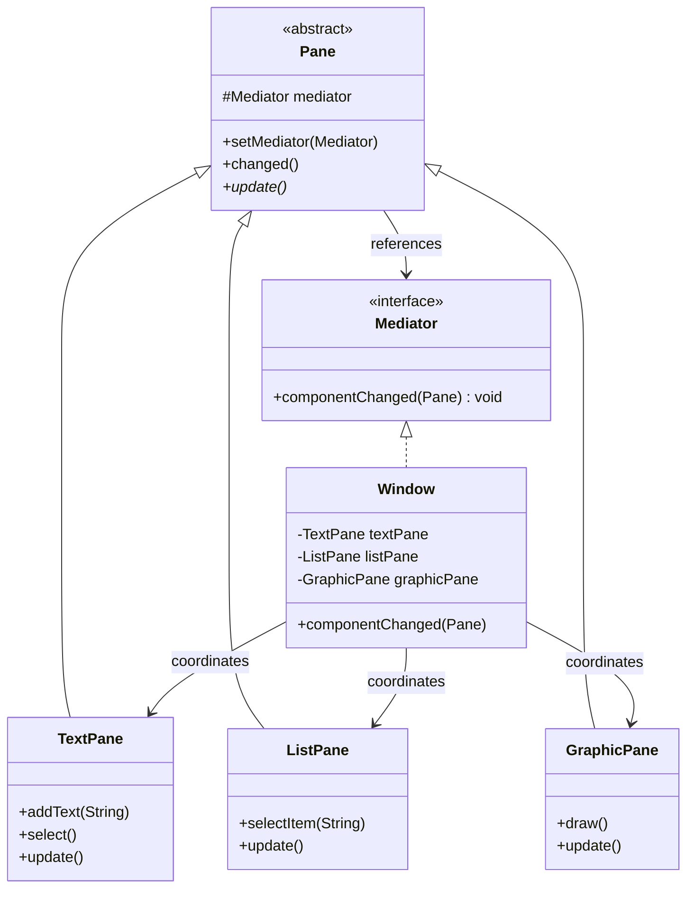

# 中介者模式 (Mediator Pattern) - 图形界面类库

## 模式简介
中介者模式 (Mediator Pattern) 用一个中介对象来封装一系列的对象交互，中介者使各对象不需要显式地相互引用，从而使其耦合松散，而且可以独立地改变它们之间的交互。

## 场景描述
Sunny软件公司开发图形界面类库：
- **Colleague (同事类)**: `TextPane`, `ListPane`, `GraphicPane`.
    - 这些窗格之间不允许直接引用。
- **Mediator (中介者)**: `Window`.
    - 包含一组窗格。
    - 协调窗格之间的行为（联动）。

## 实现方案
1.  **Mediator 接口**: 定义 `componentChanged(Pane pane)` 方法。
2.  **Pane (Abstract Colleague)**: 持有 `Mediator` 引用，定义 `changed()` 方法通知中介者。
3.  **Concrete Colleagues**: `TextPane`, `ListPane`, `GraphicPane`. 实现各自业务逻辑，在关键操作后调用 `changed()`。
4.  **Window (Concrete Mediator)**: 
    - 持有所有 Pane 的引用。
    - 在 `componentChanged` 中根据传入的 Pane 类型判断，并调用其他 Pane 的 `update()` 方法进行协调。

## 类图结构


## 关键代码
```java
// Pane.java
public void changed() {
    if (mediator != null) {
        mediator.componentChanged(this);
    }
}

// Window.java (Mediator)
public void componentChanged(Pane pane) {
    if (pane == listPane) {
        textPane.update();
        graphicPane.update();
    }
    // ...
}
```
