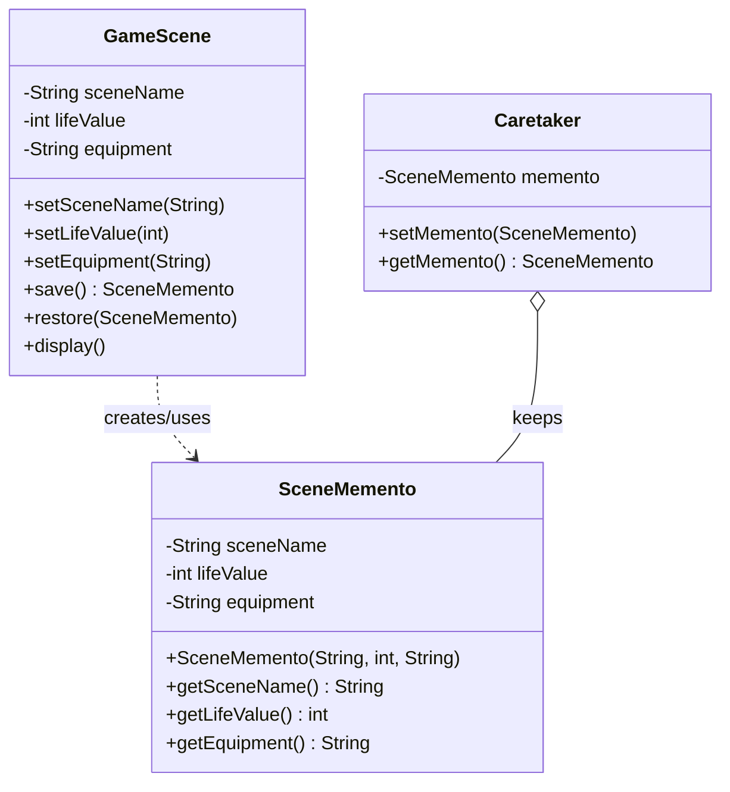

# 备忘录模式 (Memento Pattern) - 游戏恢复点

## 模式简介
备忘录模式 (Memento Pattern) 在不破坏封装性的前提下，捕获一个对象的内部状态，并在该对象之外保存这个状态。这样以后就可将该对象恢复到原先保存的状态。

## 场景描述
RPG网游中，玩家可以设置“恢复点”（Save Point）。
- 玩家角色“不幸牺牲”时，可以返回到先前保存的场景，恢复状态（场景、生命值、装备等）。

## 实现方案
1.  **Originator (原发器)**: `GameScene`.
    - 拥有内部状态：`sceneName`, `lifeValue`, `equipment`.
    - `save()`: 创建 `SceneMemento`。
    - `restore(SceneMemento)`: 恢复状态。
2.  **Memento (备忘录)**: `SceneMemento`.
    - 存储 `GameScene` 的状态。
    - 防止 `GameScene` 以外的对象访问内部状态（Java中通过访问权限控制，这里简化为 Getter）。
3.  **Caretaker (负责人)**: `Caretaker`.
    - 负责保存 `SceneMemento`。
    - 不能对 Memento 的内容进行操作或检查。

## 类图结构


## 关键代码
```java
// Originator: 创建快照
public SceneMemento save() {
    return new SceneMemento(this.sceneName, this.lifeValue, this.equipment);
}

// Originator: 恢复快照
public void restore(SceneMemento memento) {
    if (memento != null) {
        this.sceneName = memento.getSceneName();
        // ...
    }
}
```
