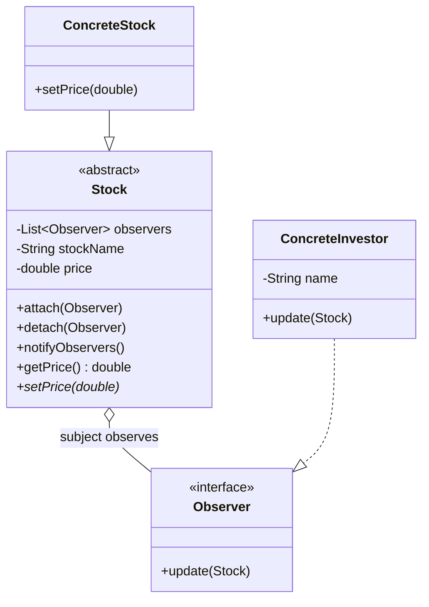

# 观察者模式 (Observer Pattern) - 股票预警系统

## 模式简介
观察者模式 (Observer Pattern) 定义对象间的一种一对多的依赖关系，当一个对象的状态发生改变时，所有依赖于它的对象都得到通知并被自动更新。

## 场景描述
Sunny软件公司开发实时在线股票软件：
- 当股票 (Stock) 价格变化幅度达到 5% 时，系统自动发送通知给购买该股票的所有股民 (Investor)。

## 实现方案
1.  **Subject (目标/被观察者)**: `Stock`。
    - 维护一个观察者列表 `observers`。
    - 提供 `attach`, `detach`, `notifyObservers` 方法。
    - 定义 `setPrice` 抽象方法，或在基类中实现部分逻辑。
2.  **Observer (观察者)**: `Observer` 接口。
    - 定义 `update(Stock stock)` 方法。
3.  **ConcreteSubject (具体目标)**: `ConcreteStock`。
    - 实现 `setPrice`。计算新旧价格变化幅度。
    - 如果幅度 >= 5%，调用 `notifyObservers()`。
4.  **ConcreteObserver (具体观察者)**: `ConcreteInvestor`。
    - 实现 `update` 方法，接收并处理通知（打印消息）。

## 类图结构


## 关键代码
```java
// ConcreteStock.java
public void setPrice(double newPrice) {
    double range = Math.abs(newPrice - this.price) / this.price;
    this.price = newPrice;
    
    if (range >= 0.05) {
        notifyObservers();
    }
}

// ConcreteInvestor.java
public void update(Stock stock) {
    System.out.println("通知 " + name + ": 股票 " + stock.getStockName() + " 价格波动，现价: " + stock.getPrice());
}
```
