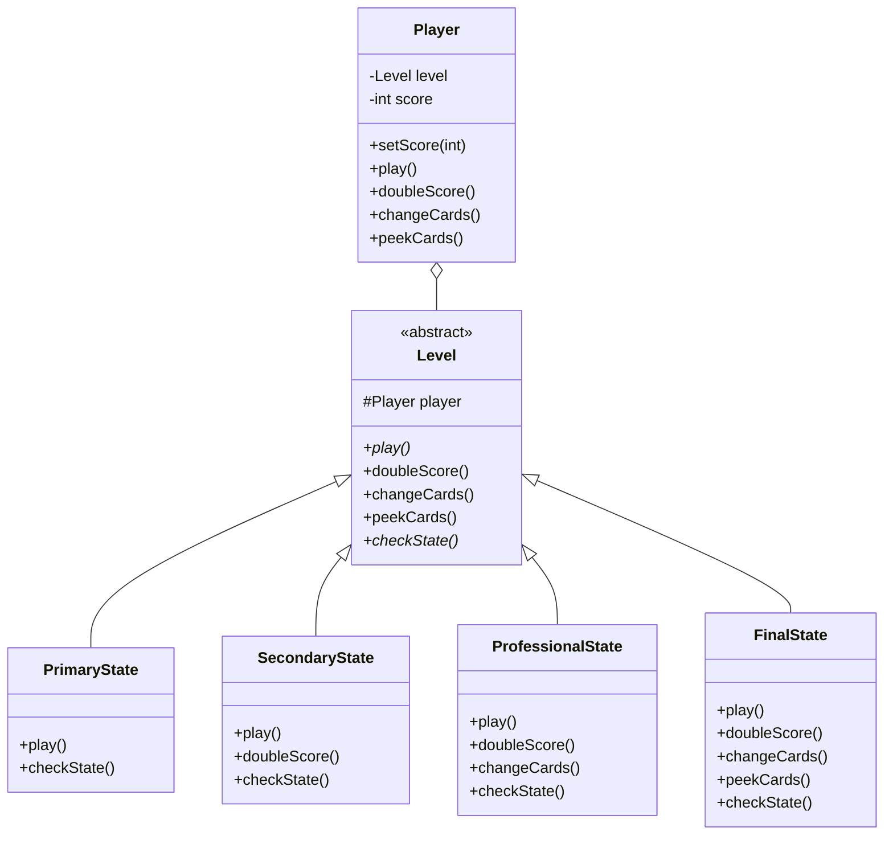

# 状态模式 (State Pattern) - 纸牌游戏等级系统

## 模式简介
状态模式 (State Pattern) 允许一个对象在其内部状态改变时改变它的行为，对象看起来似乎修改了它的类。

## 场景描述
Sunny软件公司开发纸牌游戏，玩家角色根据积分有不同等级，每个等级具有不同的功能权限：
-   **Primary (入门级)**: 基本 `play()`.
-   **Secondary (熟练级)**: `play()`, `doubleScore()` (积分加倍).
-   **Professional (高手级)**: `play()`, `doubleScore()`, `changeCards()` (换牌).
-   **Final (骨灰级)**: `play()`, `doubleScore()`, `changeCards()`, `peekCards()` (偷看牌).

等级转换规则（假设）：
- Primary: < 100
- Secondary: [100, 200)
- Professional: [200, 300)
- Final: >= 300

## 实现方案
1.  **Context (环境类)**: `Player`.
    - 持有当前状态 `Level`.
    - 代理所有请求给 `Level`.
    - 在 `setScore` 时触发状态检查 `checkState()`.
2.  **State (抽象状态)**: `Level`.
    - 定义 `play`, `doubleScore`, `changeCards`, `peekCards` 接口.
    - 提供默认的“不支持该功能”实现（或者抛出异常）.
    - 定义 `checkState()` 用于判断积分并切换状态.
3.  **ConcreteState (具体状态)**: 
    - `PrimaryState`, `SecondaryState`, `ProfessionalState`, `FinalState`.
    - 实现该等级支持的特定方法.
    - 在 `checkState` 中根据积分创建新的状态对象并赋值给 Player.

## 类图结构


## 关键代码
```java
// Player.java
public void setScore(int score) {
    this.score = score;
    // 委托状态对象检查是否需要流转
    level.checkState();
}

// Level.java (Template for checkState)
public void checkState() {
    if (player.getScore() >= 100) {
        player.setLevel(new NextLevel(this));
    }
}
```
