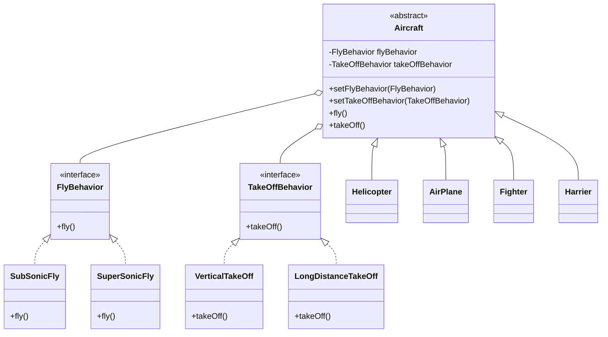

# 策略模式 (Strategy Pattern) - 飞机模拟系统

## 模式简介
策略模式 (Strategy Pattern) 定义了一系列算法，将每一个算法封装起来，并让它们可以相互替换。策略模式让算法独立于使用它的客户而变化。本案例中，我们将飞机的“飞行特征”和“起飞特征”作为可变的算法（策略）进行封装。

## 场景描述
Sunny软件公司开发飞机模拟系统，需要模拟不同种类飞机的特征：
-   **飞行特征 (FlyBehavior)**: 
    -   亚音速飞行 (SubSonicFly): 平稳巡航。
    -   超音速飞行 (SuperSonicFly): 极速穿梭。
-   **起飞特征 (TakeOffBehavior)**: 
    -   垂直起飞 (VerticalTakeOff)。
    -   长距离滑行起飞 (LongDistanceTakeOff)。

系统需要具备良好的扩展性，以便将来支持更多种类的飞机或新的飞行/起飞方式，同时允许在运行时动态改变飞机的行为（例如给直升机安装助推器）。

## 实现方案
我们将系统划分为以下几个角色：

1.  **Strategy (抽象策略)**: 
    -   `FlyBehavior`: 定义 `fly()` 接口，位于 `strategy.fly` 包。
    -   `TakeOffBehavior`: 定义 `takeOff()` 接口，位于 `strategy.takeoff` 包。
2.  **ConcreteStrategy (具体策略)**:
    -   `SubSonicFly`, `SuperSonicFly`: 实现具体的飞行逻辑。
    -   `VerticalTakeOff`, `LongDistanceTakeOff`: 实现具体的起飞逻辑。
3.  **Context (环境类)**: `Aircraft` (位于 `strategy` 包)。
    -   持有 `FlyBehavior` 和 `TakeOffBehavior` 接口的引用。
    -   通过 `setFlyBehavior` 和 `setTakeOffBehavior` 方法支持动态注入策略。
    -   核心业务方法 `fly()` 和 `takeOff()` 委托给策略对象执行。
4.  **ConcreteContext (具体环境类)**:
    -   `Helicopter`, `AirPlane`, `Fighter`, `Harrier` (位于 `strategy.aircraft` 包)。
    -   在构造函数中，根据该飞机的特性，初始化对应的具体策略对象。

## 包结构
```text
cn.lixx.designpatterns.strategy
├── Aircraft.java           // 环境类基类
├── StrategyClient.java     // 客户端测试
├── fly/                    // 飞行策略包
│   ├── FlyBehavior.java
│   ├── SubSonicFly.java
│   └── SuperSonicFly.java
├── takeoff/                // 起飞策略包
│   ├── TakeOffBehavior.java
│   ├── LongDistanceTakeOff.java
│   └── VerticalTakeOff.java
└── aircraft/               // 具体飞机包
    ├── AirPlane.java
    ├── Fighter.java
    ├── Harrier.java
    └── Helicopter.java
```

## 类图结构


## 关键代码
```java
// Aircraft.java (核心委托逻辑)
public void fly() {
    System.out.print("[" + name + "] ");
    if (flyBehavior != null) {
        flyBehavior.fly();
    }
}

// Helicopter.java (策略组合)
public Helicopter(String name) {
    super(name);
    // 初始策略：垂直起飞 + 亚音速飞行
    this.takeOffBehavior = new VerticalTakeOff(); 
    this.flyBehavior = new SubSonicFly();
}

// 客户端动态改变策略
Aircraft helicopter = new Helicopter("直升机");
helicopter.setFlyBehavior(new SuperSonicFly()); // 升级为超音速
helicopter.fly();
```
